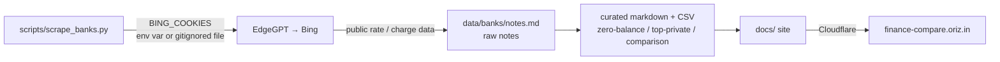

# Finance Compare

> India financial-product comparison and analysis hub — data-driven, transparent, and always sourced.

[](LICENSE)
[](https://github.com/chirag127/oriz-finance-compare/stargazers)
[](https://github.com/chirag127/oriz-finance-compare/commits/main)
[](https://www.python.org/)

**Live site: https://finance-compare.oriz.in**

## What it is / why it exists

Finance Compare is a data-driven comparison hub for Indian financial products. Every table
you see is backed by a plain-text data file under `data/`, so the numbers are auditable and
diffable — no opaque widgets, no hidden affiliate ranking. It starts with the everyday
decision most Indians actually face — which bank account to open — and grows outward from
there into stocks and investment products.

> **Disclaimer:** General information, not investment advice. Rates and charges change —
> verify directly with the provider before acting.

## Links

- **Live site (canonical):** https://finance-compare.oriz.in
- **Repository:** https://github.com/chirag127/oriz-finance-compare
- **GitHub Pages:** https://chirag127.github.io/oriz-finance-compare/ — the Cloudflare domain is
  the canonical live site; GitHub Pages serves the repo landing/about.

## ⭐ Star this repo

If this is useful, please ⭐ star the repo — it helps others find it.

## How it works



## What it compares

### Bank accounts (live)

| File | Contents |
|------|----------|
| `data/banks/zero-balance-accounts.md` | 12 zero-balance savings accounts — interest, ATM charges, digital banking fees |
| `data/banks/top-private-banks.md` | Top private banks — branches, ATMs, employees, financials |
| `data/banks/comparison.md` | Consolidated comparison table |
| `data/banks/private-banks.csv` | Raw CSV for private bank metrics |
| `data/banks/notes.md` | Scraped raw notes from EdgeGPT |

### Coming next

- `data/stocks/` — NSE/BSE stock comparison (P/E, dividend yield, 52-week range)
- `data/investments/` — Mutual funds, FD rates, NBFC products

## How data is generated

`scripts/scrape_banks.py` uses [EdgeGPT](https://github.com/acheong08/EdgeGPT) to query Bing for
each bank's public rate/charge data and writes results to `data/banks/notes.md`.

Cookies are **never hardcoded** — provide via env var or a gitignored file:

```bash
# Option 1: env var
export BING_COOKIES='[{"name":"_U","value":"...","domain":".bing.com"}]'
python scripts/scrape_banks.py

# Option 2: file (gitignored)
cp bing_cookies.example.json bing_cookies.json
# fill in your cookies
python scripts/scrape_banks.py
```

To publish a markdown file to Medium:

```bash
export MEDIUM_TOKEN=your_medium_integration_token
python scripts/publish.py data/banks/comparison.md -t "Top Zero Balance Accounts in India" -p public
```

## Configuration

| Env var | Purpose |
|---------|---------|
| `BING_COOKIES` | Bing auth cookies for EdgeGPT scraping. Provided via env or a gitignored `bing_cookies.json`, **never committed**. `bing_cookies.example.json` is an example only. |
| `MEDIUM_TOKEN` | Medium integration token used by `scripts/publish.py` to publish a markdown file. |

## Repo structure

```
oriz-finance-compare/
├── data/
│   └── banks/
│       ├── zero-balance-accounts.md   12 zero-balance savings accounts
│       ├── top-private-banks.md       top private banks + financials
│       ├── comparison.md              consolidated comparison table
│       ├── private-banks.csv          raw CSV metrics
│       └── notes.md                   scraped raw notes from EdgeGPT
├── scripts/
│   ├── scrape_banks.py                EdgeGPT/Bing scraper → data/banks/notes.md
│   └── publish.py                     publish a markdown file to Medium
├── docs/                              served site (CNAME finance-compare.oriz.in)
├── bing_cookies.example.json          example cookie shape (safe; no real cookies)
└── LICENSE                            MIT
```

## Quick start

```bash
git clone https://github.com/chirag127/oriz-finance-compare.git
cd oriz-finance-compare

# View the site locally
python -m http.server 8080 --directory docs
# then open http://localhost:8080
```

## Features

- Auditable, diffable data — every table is backed by a plain markdown/CSV file
- 12 zero-balance savings accounts compared (interest, ATM charges, digital fees)
- Top private banks — branches, ATMs, employees, financials
- Consolidated comparison table + raw CSV export
- Reproducible data pipeline via `scripts/scrape_banks.py` (EdgeGPT/Bing)
- Cookies never committed — env var or gitignored file only
- Static site — hosts anywhere, **$0 on the Cloudflare free tier**

## Tech stack

- **Python 3.10+** — `scripts/scrape_banks.py`, `scripts/publish.py`
- **EdgeGPT** — queries Bing for public rate/charge data
- **Markdown + CSV** — the data layer
- **Static `docs/` site** — served via Cloudflare (canonical) / GitHub Pages

## Data sources

Data sourced from publicly available bank websites, RBI publications, and BSE/NSE filings.
Rates and charges change — verify directly with the bank.

## Part of the oriz family

Finance Compare is one of ~80 sites and tools in the **oriz** family. Explore the rest at
[blog.oriz.in](https://blog.oriz.in).

## Contributing

Issues and PRs welcome. Keep data changes sourced and reproducible — update the underlying
data file, not just the rendered table. Conventional commits are the changelog.

## License

MIT — see [LICENSE](LICENSE).

## Author

**Chirag Singhal** — chirag@oriz.in

## Status / roadmap

Live and maintained. Next: `data/stocks/` (NSE/BSE comparison) and `data/investments/`
(mutual funds, FD rates, NBFC products).
